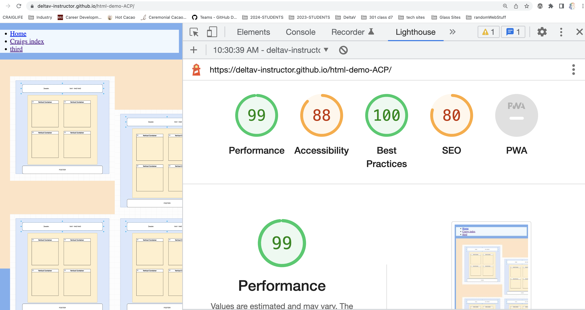

# class-02-demo-htmlcssjs

Using Lighthouse in the Chrome DevTools, analyze the accessibility of your application.

The following options to generate a Lighthouse report should be selected:
Mode: Navigation
Device: Desktop
Categories: Accessibility
Strive for a score between 50-65. Make necessary adjustments based on the report to achieve that score.
Add a screenshot of your score to your README.md file.

# LAB - 2

## About Me

About Me demo in lecture for class 2 lab.

### Author: Craig Barkley

### Links and Resources

* [submission PR](http://xyz.com)
* Eric Meyer

### Lighthouse Accessibility Report Score

### Reflections and Comments

* thanks for stopping by to view my about me web page
